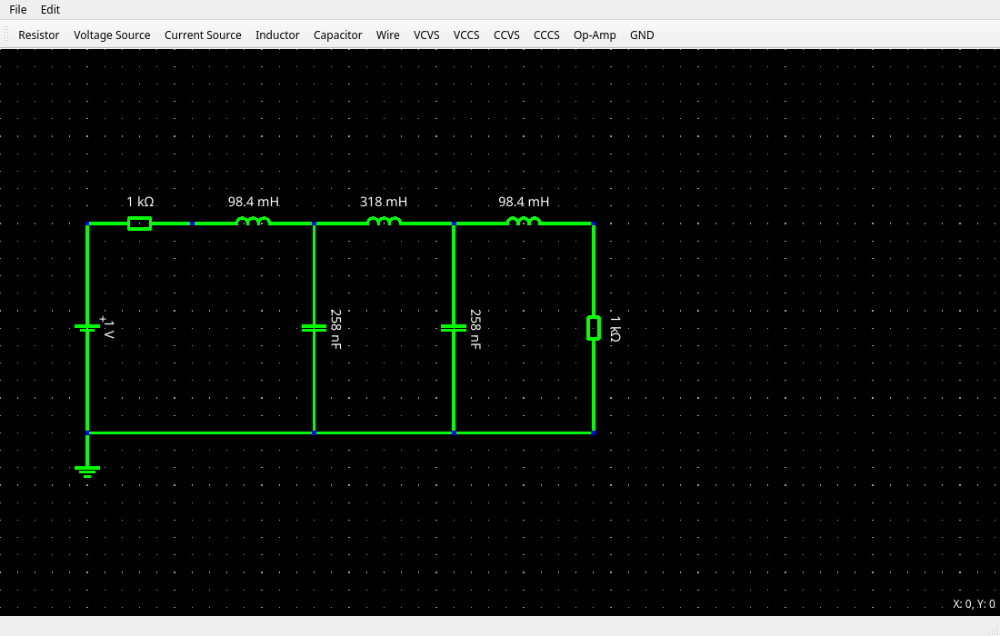
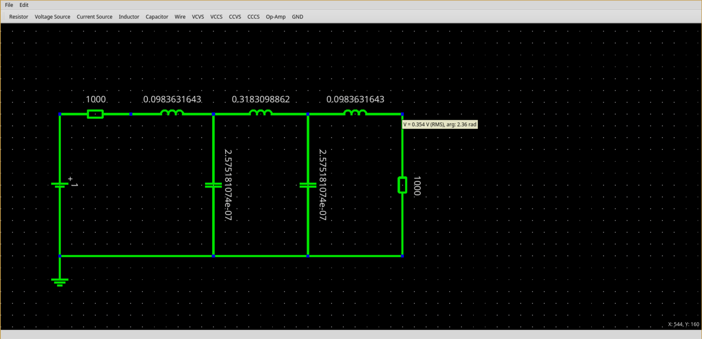
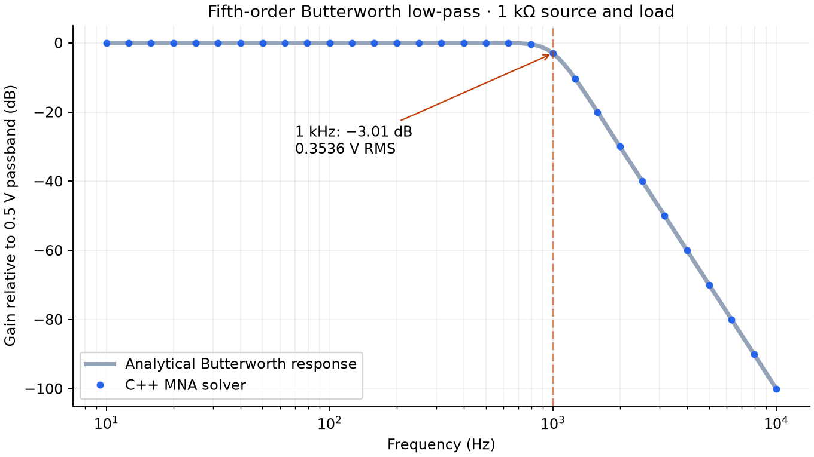

# Circuit Simulator

A C++17 circuit simulator with a Qt editor. It solves DC operating points and
single-frequency AC responses using Modified Nodal Analysis (MNA) and Eigen.



The circuit model supports resistors, capacitors, inductors, independent
voltage/current sources, all four dependent-source types, and ideal op-amps.
The editor displays node voltages and component currents, and can save and load
a subset of the Falstad circuit format.

AC plots reconstruct steady-state sinusoids from complex phasors. There is no
transient solver, nonlinear device model, or op-amp saturation model.

## Butterworth filter demo

Open [the saved fifth-order filter](saved_circuits/butterworth_5th_order_1khz.txt)
in the GUI, then select AC analysis at 1 kHz under **Configure Simulation** and
run the simulation. Hover over the output node to inspect its voltage.

<details>
<summary>Single-frequency simulation screenshot at 1 kHz</summary>



</details>

With a 1 V RMS source and matched 1 kΩ source/load resistors, the output is
approximately 0.5 V RMS in the passband and **0.3536 V RMS at 1 kHz**: −3.01 dB
relative to the passband. The sweep below is generated by the C++ solver and
compared with `|Vout| = 0.5 / sqrt(1 + (f / 1000)^10)`.



The [demo executable](examples/butterworth.cpp) checks all 121 frequency points
against that analytical response within 0.1 µV absolute error. It is also run
by CTest. Regenerate the [CSV](docs/results/butterworth.csv) and figure after building:

```bash
./build/butterworth_demo docs/results/butterworth.csv
python scripts/plot_butterworth.py  # requires matplotlib
```

The magnitude sweep is a standalone example; the GUI plots sinusoidal waveforms
at a single selected frequency.

## Build and run

On Ubuntu/Debian, install a C++17 compiler, CMake 3.16+, and Qt 5:

```bash
sudo apt update
sudo apt install build-essential cmake git qtbase5-dev
git clone https://github.com/mxlaine/circuit_simulator.git
cd circuit_simulator
cmake -S . -B build -DCMAKE_BUILD_TYPE=Release
cmake --build build --parallel 2
./build/gui/circuit_sim_gui
```

Eigen, Catch2, and QCustomPlot are bundled in `libs/`. Launch the GUI from the
repository root so the saved circuits are easy to find. A desktop session is
required.

For a build without Qt:

```bash
cmake -S . -B build-cli -DBUILD_GUI=OFF -DCMAKE_BUILD_TYPE=Release
cmake --build build-cli --parallel 2
./build-cli/circuit_sim
cmake -E chdir build-cli ctest --output-on-failure
```

`circuit_sim` runs the hard-coded examples in [src/main.cpp](src/main.cpp);
it does not accept a netlist filename. To run tests in the GUI build, use
`cmake -E chdir build ctest --output-on-failure`.

## Implementation and tests

The shared `circuit_sim_core` library contains the circuit model, netlist parser,
and solver. DC and AC assemble dense real and complex matrices respectively,
then solve them with Eigen's column-pivoted Householder QR. This is suited to the
small example circuits here; large-circuit performance has not been benchmarked.
See the [source guide](src/readme.md) for the main entry points.

[Catch2 tests](tests/) compare voltages and currents with analytical results for
DC dividers, RC/RL filters, LC resonance, dependent sources, and ideal op-amps.
CTest also runs the Butterworth sweep above. [CI](.github/workflows/ci.yml)
builds and tests the core and CLI with GCC and Clang in Release mode; it does not
build the Qt GUI.

## File formats and limitations

The [netlist parser](src/io/netlist_parser.cpp) accepts a small SPICE-like syntax:
`.DC` or `.AC <frequency_hz>` first, numeric node names with `0` as ground, and
values in SI base units. For example, a DC divider is:

```text
.DC
V1 1 0 10
R1 1 2 1000
R2 2 0 1000
```

Blank lines and `#` comments are accepted. This format is separate from the
editor's Falstad import/export; neither provides full SPICE or Falstad compatibility.

Missing ground and empty networks are rejected. The topology check can warn
about singular circuits, but it does not validate the rank or residual of the
full solved DC/AC system. Results for floating or contradictory circuits should
not be treated as valid merely because the solver returns numbers.

DC netlist parsing replaces inductors with short circuits. Direct callers of
`Circuit::AddInductor` do not get that conversion; the DC solver does not stamp
those inductors. Use the AC solver for the RLC examples built through that API.
